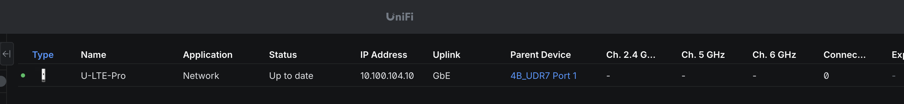
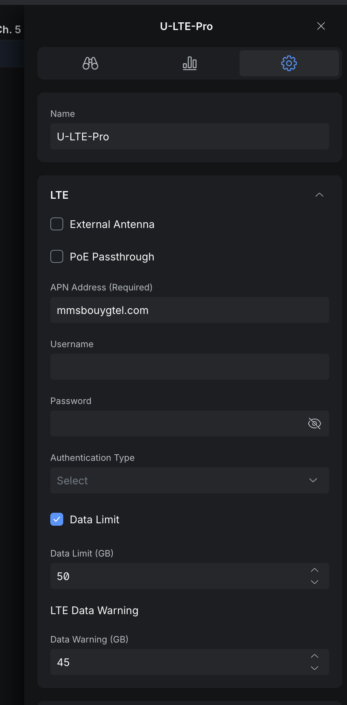
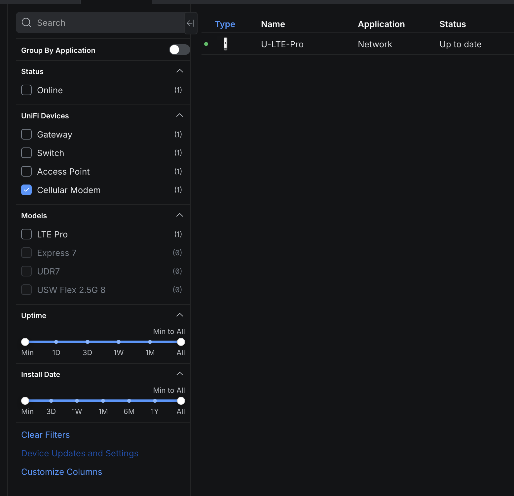

# unifi-rest-sms-gateway

This is a simple REST gateway to use the SMS functionality of the UniFi LTE Backup Pro device. It exposes an HTTP API to send, receive SMS messages and check the status of the LTE connection.

This project is heavily inspired by [CppBunny/unifi_sms_gateway](https://github.com/CppBunny/unifi_sms_gateway) but with a REST API interface and written in TypeScript using Bun.

## Requirements

- A [UniFi LTE Backup Pro](https://eu.store.ui.com/eu/en/category/internet-solutions/collections/unifi-lte-backup/products/u-lte-pro) device
  - I don't own the 5G version, but if you do, feel free to open up a PR to add support for it.
- A SIM card with SMS capabilities (and data of course as it is mainly a LTE backup device)
- Docker

## Getting Started

1. Make sure your U-LTE-Pro device is updated and adopted. It should show up like this (ignoring the IP of course): 
  - As a side note, make sure you configure your U-LTE-Pro correctly, with the SIM card PIN code as well as a data limit 
2. Get your SSH credentials from the UniFi Network Controller. You can find them in "Device Settings" under "Device Updates and Settings" on the left side of the UniFi Devices page. Enable the "Device SSH Authentication" if you can't see the credentials. . 
3. Create an optional API Key for this gateway, it can be anything you want. It will be used by the clients to authenticate with the container's REST API.
  - Not setting an API key will disable authentication on the REST API, which is **not recommended** if you expose it to untrusted networks.
4. Start the Docker container with the following command, replacing the placeholders with your actual values:

```bash
docker run -d \
  -e SSH_HOST="<your-unifi-lte-backup-pro-ip>" \
  -e SSH_USERNAME="<your-ssh-username>" \
  -e SSH_PASSWORD="<your-ssh-password>" \
  -e API_KEY="<your-api-token>" \
  -e ENABLE_WEB_UI="true" \
  -e PORT="3000" \
  -p 3000:3000 \
  ghcr.io/jiveoff/unifi-rest-sms-gateway:latest
```

5. The REST API should now be accessible at `http://localhost:3000`. You can test it by sending a GET request to `http://localhost:3000/info` with the `X-API-Key` header set to the API key you created at step 3.

## Environment Variables

All environment variables are validated on startup using a Zod schema:

| Variable | Required | Default | Description |
|----------|----------|---------|-------------|
| `SSH_HOST` | No | - | IP address of your U-LTE-Pro device |
| `SSH_USERNAME` | No | - | SSH username from UniFi controller |
| `SSH_PASSWORD` | No | - | SSH password from UniFi controller |
| `API_KEY` | No | - | Secret key for API authentication. Leave unset to disable auth (not recommended) |
| `ENABLE_WEB_UI` | No | `true` | Set to `false` to disable the web interface at `/` |
| `ENABLE_SENSITIVE_LOGS` | No | `false` | Set to `true` to log SMS content and phone numbers (NOT recommended for privacy) |
| `PORT` | No | `3000` | Port the server listens on |`

Copy `.env.example` to `.env` and fill in your values for local development.

## Authentication

All API endpoints (but **not** static files) are protected by an API key when `API_KEY` is set in the environment.

**REST API**: Include the API key in requests using either:
- `X-API-Key` header: `X-API-Key: your-secret-key`
- `Authorization` header: `Authorization: Bearer your-secret-key`

**WebSocket**: After connecting, send an authentication message:
```json
{ "type": "auth", "apiKey": "your-secret-key" }
```

**Web Interface**: The browser client at `http://localhost:3000` (when `ENABLE_WEB_UI=true`) will prompt for the API key on first visit and store it in localStorage. The static files themselves are served without authentication.

If `API_KEY` is not configured, authentication is disabled (not recommended for production).

## API Documentation

### REST Endpoints

All endpoints require `X-API-Key` header when authentication is enabled.

| Method | Endpoint | Description | Response |
|--------|----------|-------------|----------|
| `GET` | `/info` | Get SIM card and LTE connection info | `SimInfo` object |
| `GET` | `/messages` | Get all SMS messages | Array of `SmsMessage` |
| `GET` | `/messages/count` | Get total message count | `{ count: number }` |
| `GET` | `/messages/latest` | Get most recent SMS | `SmsMessage` object |
| `GET` | `/messages/:index` | Get SMS by index (0-based) | `SmsMessage` object |
| `DELETE` | `/messages` | Delete all SMS messages | `{ success: true, cleared: number }` |
| `POST` | `/messages` | Send SMS | `{ success: true, message: string }` |

**POST /messages body:**
```json
{
  "number": "+1234567890",
  "content": "Your message here"
}
```

**SmsMessage schema:**
```json
{
  "index": 0,
  "type": "LE_SMS_TYPE_RX",
  "sender": "+1234567890",
  "timestamp": "2026-01-09T12:34:56+01:00",
  "format": "LE_SMS_FORMAT_TEXT",
  "text": "Message content",
  "textLength": 15
}
```

### WebSocket

**Endpoint:** `ws://localhost:3000/messages/monitor`

Real-time SMS monitoring. Connect and authenticate, then receive new SMS messages as they arrive.

**Authentication flow:**
```javascript
const ws = new WebSocket('ws://localhost:3000/messages/monitor');
ws.onopen = () => {
  ws.send(JSON.stringify({ type: 'auth', apiKey: 'your-key' }));
};
ws.onmessage = (event) => {
  const message = JSON.parse(event.data);
  // Receives SmsMessage objects or auth responses
};
```

